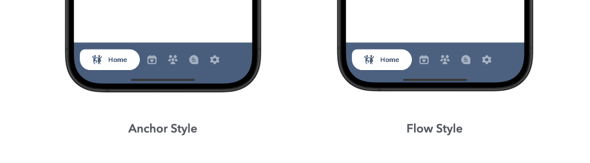

# 🧋 TapiocaTabBar

**TapiocaTabBar** is a playful and smooth custom tab bar built with SwiftUI.  
Inspired by the soft, gliding texture of tapioca pearls, this component brings a fresh, fluid experience to app navigation.

Designed to blend aesthetics with motion, TapiocaTabBar aligns icons and titles horizontally in a unique, animated layout — perfect for apps that want to stand out with personality and polish.

Because tab bars can be fun, too.


---

## ✨ Features

- Horizontal icon + label layout
- Smooth animation with `matchedGeometryEffect`
- Custom corner radius with clipping using `CustomRoundedRectangle`
- Enum-driven tab management
- Clean MVVM-friendly design
- Works with full-screen ZStack layout
- Easy integration and theming
- Customizable color and style (`flow` and `anchor` modes)
- Dynamic updates to tab titles and icons using `ObservableObject`
- MVVM integration with external `TapiocaTabBarViewModel`

---

## 📦 Installation

### Swift Package Manager (SPM)

Add this repository to your Xcode project:

```
https://github.com/squall09s/TapiocaTabBar
```

Then import:

```swift
import TapiocaTabBar
```


---

## 🎨 Available Styles

### Flow – Dynamic and Adaptive Highlight

In **Flow** style, the focus fluidly moves between tabs with a smooth animated capsule that follows the selected item.  
The label appears only on the active tab, giving the navigation a clean, lightweight, and dynamic feeling.

### Anchor – Fixed Main Tab Emphasis

In **Anchor** style, the main tab remains visually emphasized at all times with a fixed capsule and title, even when navigating to other tabs.  
Selection is indicated through subtle color and opacity changes, maintaining the spotlight on the primary action tab.

<p align="center">
  
</p>

---


## 🧑‍💻 Example usage

```swift
struct ContentView: View {
    @StateObject private var viewModel = TapiocaTabBarViewModel(items: [
        TapiocaTabBarItem(icon: Image(systemName: "house.fill"), title: "Home"),
        TapiocaTabBarItem(icon: Image(systemName: "star.fill"), title: "Favorites"),
        TapiocaTabBarItem(icon: Image(systemName: "person.fill"), title: "Profile")
    ])
    
    var body: some View {
        ZStack {
            selectedView(for: viewModel.selectedIndex)
                .frame(maxWidth: .infinity, maxHeight: .infinity)
            
            TapiocaTabBar(
                viewModel: viewModel,
                color: .orange,
                style: .flow
            )
            .frame(maxHeight: .infinity, alignment: .bottom)
        }
    }

    @ViewBuilder
    private func selectedView(for index: Int) -> some View {
        switch index {
        case 0: HomeView()
        case 1: FavoritesView()
        case 2: ProfileView()
        default: EmptyView()
        }
    }
}
```

---

## 🍡 Why "Tapioca"?

Because it's soft, smooth, and slides like a charm — just like this tab bar. Plus, it's fun to say.

---

## 📄 License

MIT — free to use, even in your bubble tea shop 🍹
