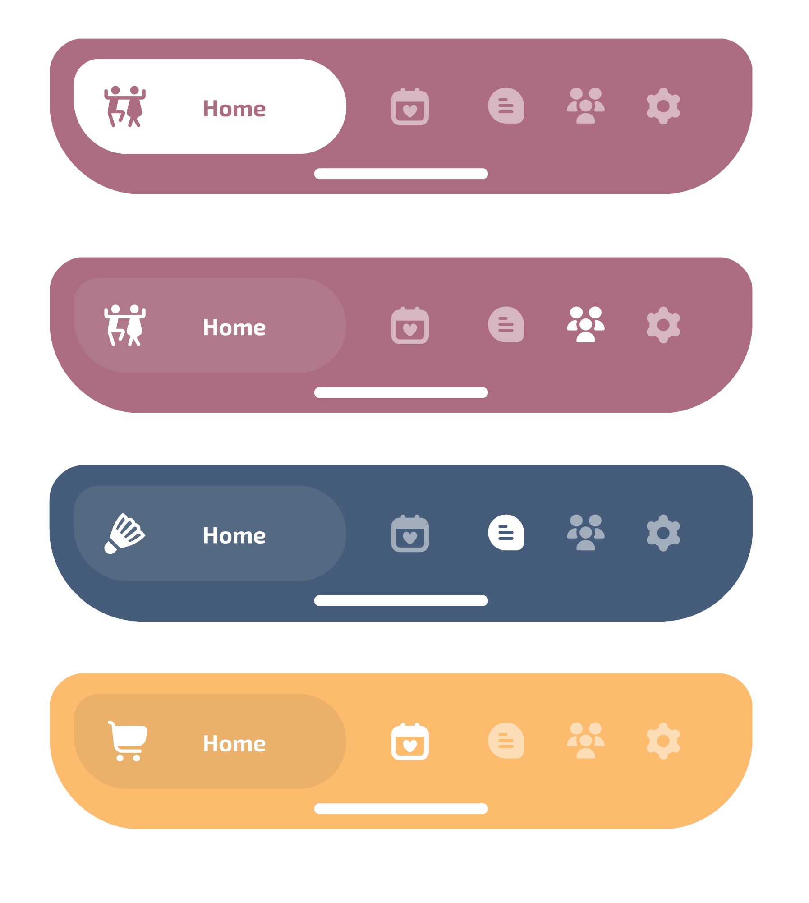

# 🧋 TapiocaTabBar

**TapiocaTabBar** is a playful and smooth custom tab bar built with SwiftUI.  
Inspired by the soft, gliding texture of tapioca pearls, this component brings a fresh, fluid experience to app navigation.

Designed to blend aesthetics with motion, TapiocaTabBar aligns icons and titles horizontally in a unique, animated layout — perfect for apps that want to stand out with personality and polish.

Because tab bars can be fun, too.



---

## ✨ Features

- Horizontal icon + label layout
- Smooth animation with `matchedGeometryEffect`
- Custom corner radius with clipping using `CustomRoundedRectangle`
- Enum-driven tab management
- Clean MVVM-friendly design
- Works with full-screen ZStack layout
- Easy integration and theming
- Customizable color and style (`flow` and `anchor` modes)


---

## 📦 Installation

### Swift Package Manager (SPM)

Add this repository to your Xcode project:

```
https://github.com/squall09s/TapiocaTabBar
```

Then import:

```swift
import TapiocaTabBar
```

---

## 🧑‍💻 Example usage

```swift
enum DemoTab: Int, CaseIterable, Identifiable {
    
    case home
    case favorites
    case profile
    
    var id: Int { rawValue }
    
    var title: String {
        switch self {
        case .home:
            return "Home"
        case .favorites:
            return "Favorites"
        case .profile:
            return "Profile"
        }
    }
    
    var icon: Image {
        switch self {
        case .home:
            return Image("...")
        case .favorites:
            return Image("...")
        case .profile:
            return Image("...")
        }
    }
    
    var item: TapiocaTabBarItem {
        TapiocaTabBarItem(icon: icon, title: title)
    }
}

struct ContentView: View {
    
    @State private var selectedTab: DemoTab = .home
    let tabs = DemoTab.allCases.map(\.item)
    
    var body: some View {
        
        ZStack {
            
            selectedView(for: selectedTab).frame(maxWidth: .infinity, maxHeight: .infinity)
            
            TapiocaTabBar(
                selectedIndex: Binding(
                    get: { selectedTab.rawValue },
                    set: { newValue in
                        if let newTab = DemoTab(rawValue: newValue) {
                            selectedTab = newTab
                        }
                    }
                ),
                items: tabs,
                color: .orange, // Default
                style: .flow    // Default style
            )
            .frame(maxHeight: .infinity, alignment: .bottom)
        }
    }
    
    @ViewBuilder
    private func selectedView(for tab: DemoTab) -> some View {
        
        switch tab {
        case .home:
            HomeView()
        case .favorites:
            FavoritesView()
        case .profile:
            ProfileView()
        }
    }
}
```

---

## 🎨 Available Styles

### Flow – Dynamic and Adaptive Highlight

In **Flow** style, the focus fluidly moves between tabs with a smooth animated capsule that follows the selected item.  
The label appears only on the active tab, giving the navigation a clean, lightweight, and dynamic feeling.

### Anchor – Fixed Main Tab Emphasis

In **Anchor** style, the main tab remains visually emphasized at all times with a fixed capsule and title, even when navigating to other tabs.  
Selection is indicated through subtle color and opacity changes, maintaining the spotlight on the primary action tab.

---

## 🍡 Why "Tapioca"?

Because it's soft, smooth, and slides like a charm — just like this tab bar. Plus, it's fun to say.

---

## 📄 License

MIT — free to use, even in your bubble tea shop 🍹
